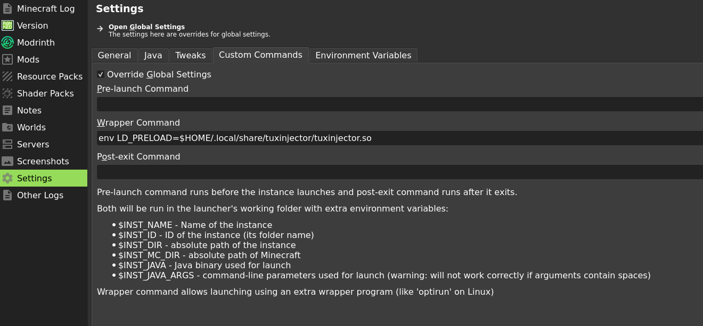

# Installation & Usage

## Installation

When installing Tux Injector, it is reccomended to put the library at a permanant path, such as `~/.local/share/tuxinjector`. You can also download the latest release and move the binary there manually.

```bash
mkdir -p ~/.local/share/tuxinjector
curl -fL https://github.com/flammablebunny/tuxinjector/releases/latest/download/tuxinjector.so -o ~/.local/share/tuxinjector/tuxinjector.so
```

!!! note
    NixOS users should skip this and follow the [NixOS](#nixos) section below instead.

## Prism Launcher

To inject Tuxinjector into Minecraft while using [Prism Launcher](https://prismlauncher.org/), you need to set a **Wrapper Command** in its settings.

### Steps

1. Open Prism Launcher and select your Minecraft instance.
2. Click **Settings** in the sidebar.
3. Go to the **Custom Commands** tab.
4. Check **Override Global Settings** if it isn't already enabled.
5. In the **Wrapper Command** field, enter:

    ```
    env LD_PRELOAD=$HOME/.local/share/tuxinjector/tuxinjector.so
    ```

6. Launch the instance normally.



!!! tip
    Unlike [waywall](https://github.com/tesselslate/waywall) which uses `waywall --wrap` as the wrapper command to launch a nested compositor, Tuxinjector injects **directly** into the game process via `LD_PRELOAD`. The `env` command simply sets the environment variable that tells the dynamic linker to load Tuxinjector's shared library into Java before Minecraft starts.


!!! note
    You can also set this globally under **Settings > Custom Commands** in Prism Launcher's main window, which will apply to all instances.

!!! note
    You can also set the under the Environment Variables tab, by setting the name to `LD_PRELOAD`, and the value as the path to your .so file.

## NixOS

On NixOS, libraries aren't in standard paths, so companion apps (NinjaBrain Bot, etc.) need extra setup to find X11 libraries. Tuxinjector's flake provides a wrapper that handles this automatically.

### Installation

Add Tuxinjector as a flake input in your NixOS or home-manager configuration:

```nix
# flake.nix
inputs.tuxinjector = {
  url = "github:flammablebunny/tuxinjector";
  inputs.nixpkgs.follows = "nixpkgs";
};
```

Then add the package to your user's packages:

```nix
# In your home.nix or configuration.nix
home.packages = [
  inputs.tuxinjector.packages.x86_64-linux.default
];
```

Rebuild your system (`nixos-rebuild switch`).

### Prism Launcher Setup

Set the **Wrapper Command** in Prism Launcher to:

```
tuxinjector
```

That's all. The wrapper sets `LD_PRELOAD` and `TUXINJECTOR_X11_LIBS` automatically, so companion apps can find the X11 libraries they need.

!!! note
    The wrapper is Garbage Collector rooted by your system closure, so the library paths it references won't be garbage collected.

<!-- TODO: Update this for MCSR Launcher, hopefully by using the Tools Tab just like how toolscreen does it ^_^ -->
